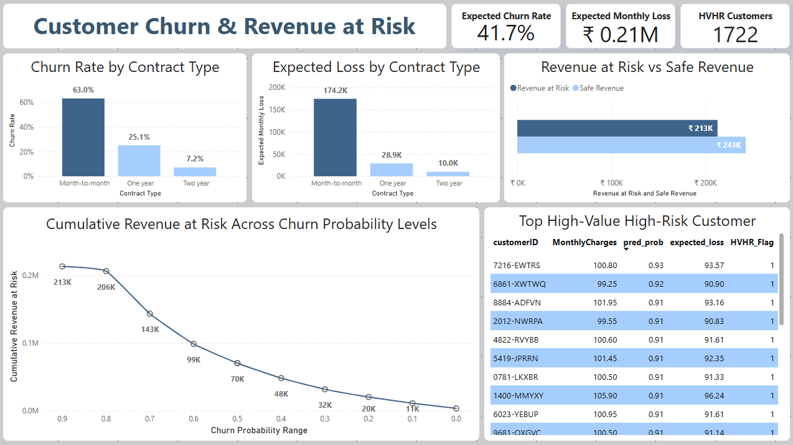

# Customer Churn Analysis

## Overview
This project looks at why customers leave a telecom company and how it affects revenue. The goal is to find patterns in customer behavior, identify who is most likely to leave, and show which groups could cause the most loss.

## Interactive Power BI Dashboard

  

> This dashboard visualizes churn patterns, customer risk levels, and revenue at risk using insights from the ML model.  
> It highlights key KPIs, contract-wise losses, churn probability distribution, and high-value high-risk customers to support data-driven retention decisions.

## Approach & Tech Stack

> Data Preparation → Churn Analysis → Modeling → Risk Scoring → Revenue Impact → Dashboard

- Python (`Pandas, NumPy, Scikit-learn`)
- Machine Learning (`Logistic Regression, Decision Tree`)
- Data Preprocessing & Feature Engineering
- Power BI Dashboard.

## Modeling & Evaluation  

Built classification models to predict customer churn using Logistic Regression and Decision Tree. Key features included contract type, tenure, monthly charges, payment method, and service usage.  

## Modeling & Evaluation  

Built classification models to predict customer churn using `Logistic Regression` and `Decision Tree`. Key features included contract type, tenure, monthly charges, payment method, and service usage.  

### Model Performance  

| Model                | Accuracy | Precision | Recall | F1-Score |
|---------------------|----------|-----------|--------|----------|
| Logistic Regression | 0.750    | 0.518     | 0.826  | 0.636    |
| Decision Tree       | 0.745    | 0.512     | 0.791  | 0.622    |

Logistic Regression performed better with higher recall and overall balanced performance, so it was selected as the final model. The model was used to assign churn probabilities, identify high-risk customers (>0.6), and estimate revenue at risk.

## Key Findings

#### Who is Leaving
- About **26.54% of customers** are leaving.  
- **Senior citizens** and **month-to-month contract customers** leave more often.  
- Customers paying by **electronic check** are more likely to leave.  
- Churn happens mostly in the **first few months** of their subscription.  
- Customers with **0–3 services** leave more often, while customers with **6 or more services** usually stay.

#### Revenue at Risk
- **46.71% of monthly revenue** could be lost if customers leave, which is around **₹2,13,073** per month.  
- **1,722 high-value customers** make up **₹1,51,890** of that loss, making them the most important group to keep.  
- **Month-to-month contracts** have the highest churn risk (0.63) and expected loss (₹1,74,151). Longer contracts lose much less money.

#### Factors Affecting Churn
- **More likely to leave:** high monthly bills, high total charges, using internet services, not having online backup.  
- **Less likely to leave:** long-term contracts, tech support, phone service, longer tenure, online security.

## Recommendations
- Focus on **month-to-month customers** to reduce the largest possible loss.  
- Pay attention to **high-value customers** with high risk.  
- Encourage customers to use **more services** like online backup and tech support.  
- Offer **discounts or incentives** to customers with high bills.  
- Engage **customers early** in their first months to prevent churn.

## Impact
- Shows which customers could cause the most revenue loss.  
- Helps decide **where to spend effort** to keep customers.  
- Converts churn predictions into **real money at risk**, making the findings clear for decision-making.

Project by [**Anurag Chauhan**](https://www.linkedin.com/in/theanuragchauhan/)
